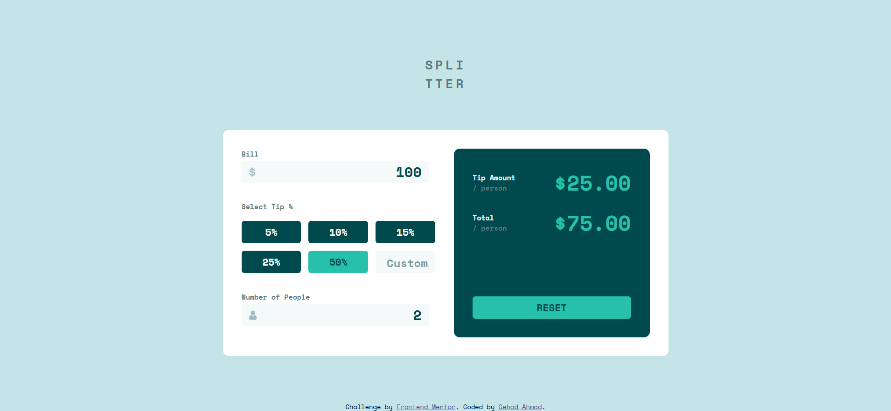
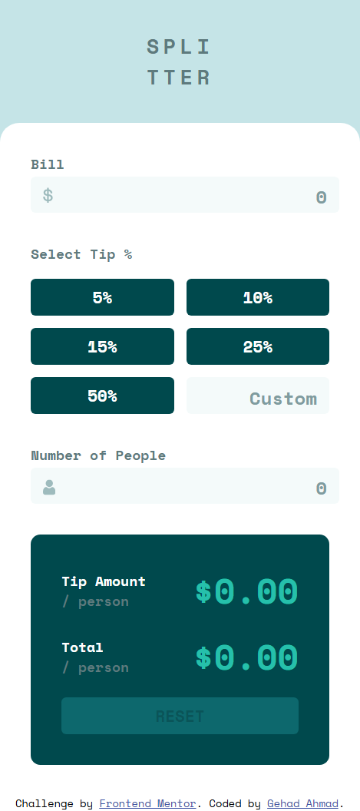

# Frontend Mentor - Tip calculator app solution

This is a solution to the [Tip calculator app challenge on Frontend Mentor](https://www.frontendmentor.io/challenges/tip-calculator-app-ugJNGbJUX). 

## Overview

### Screenshot

#### Desktop View

#### Mobile View

### Links

- Solution URL: [https://github.com/Gehad28/tip-calculator-app](https://github.com/Gehad28/tip-calculator-app)
- Live Site URL: [https://gehad28.github.io/tip-calculator-app](https://gehad28.github.io/tip-calculator-app)

## My process

### Built with

- Semantic HTML5 markup
- CSS custom properties
- Flexbox
- CSS Grid
- Desktop-first workflow

## Author

- Website - [Gehad Ahmad](https://github.com/Gehad28)
- Frontend Mentor - [@Gehad28](https://www.frontendmentor.io/profile/Gehad28)
